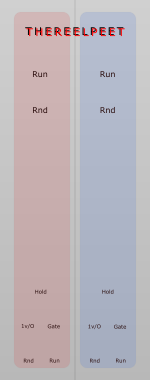

# TheReelPeet-Seq



**TheReelPeet-Seq** is a dual, clock-driven generative sequencer for VCV Rack, designed for evolving, overlapping melodic motion rather than strict step programming.

Each lane produces randomized CV values over a configurable number of steps, with independent tempo control, gating, and the ability to temporarily freeze motion using a HOLD input. The module is intended to be exploratory and musical, rewarding asymmetry and interaction between lanes.

TheReelPeet is licensed under the [MIT license](./LICENSE).

---

## Overview

TheReelPeet-Seq contains **two independent sequencer lanes (A and B)**.

Each lane includes:

- Variable step length  
- Randomized CV values per step  
- Per-lane BPM control (knob + CV input)  
- HOLD CV input to temporarily freeze the sequence  
- RUN control (gate-based)  
- Randomize trigger input  
- 1V/Oct output  
- Gate output  

The lanes are intentionally symmetrical but independent, making it easy to create phase-shifting or polyrhythmic melodic structures by using different step counts, BPM values, and modulation sources.

---

## Controls & I/O (per lane)

### BPM
- **Knob:** Sets the base tempo for the lane.
- **CV Input:** Overrides the knob when patched and updates the knob position to match.

### Length
- Sets the number of steps in the sequence.

### Run
- **Button:** Toggles run state when no RUN CV is patched.
- **RUN CV Input:** Gate-based control.  
  - High voltage = running  
  - Low voltage = stopped  
  - When patched, this input overrides the toggle button.

### Random
- **Button:** Randomizes the sequence values.
- **Random CV Input:** Trigger-based. Any rising edge will re-randomize the lane.

### Hold
- **HOLD CV Input:** Temporarily freezes the current step.
- While HOLD is active, the sequence does not advance but continues to output the current CV value.
- When HOLD releases, the sequence resumes normally.

### Outputs
- **1V/Oct CV Output:** Current step value.
- **Gate Output:** Emits a short gate when a step advances.

---

## Intended Use

TheReelPeet is best used as a **generative modulation and melody source**, rather than a traditional step sequencer.

Some recommended approaches:

- Use **different step lengths and BPM values** per lane to create evolving, non-repeating patterns.
- Drive the CV outputs into an **external quantizer** for harmonic control.
- Use slow or probabilistic sources (e.g. random gates, envelopes, sample & hold) to:
  - Trigger randomization
  - Gate RUN on and off
  - Apply HOLD at musically interesting moments
- Let one lane run continuously while the other is periodically stopped or frozen to introduce phrasing.

The module is intentionally flexible and open-ended; experimentation is encouraged.

---

## Building

To build TheReelPeet from source, you must have a working VCV Rack development environment. Follow the official guide at:

https://vcvrack.com/manual/PluginDevelopmentTutorial

After cloning the repository into your Rack `plugins` directory:

```bash
make